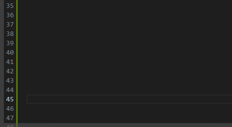

# LXL Dev Helper (Lua)
   

### 在VSCODE中安装
https://marketplace.visualstudio.com/items?itemName=moxicat.lxldev-lua

### 功能
 - 自动补全
 - 内嵌文档
 - 长期更新
 - 调试更新
 - and more...

 ### 依赖
 - [sumneko.lua](https://marketplace.visualstudio.com/items?itemName=sumneko.lua)

 ### Feedback
  - [Github Issue](https://github.com/moxicode/LXLDevHelper/issues)
  - [Pull Request](https://github.com/moxicode/LXLDevHelper/pulls)